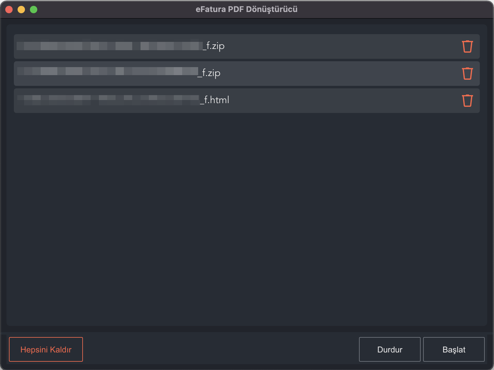

# </img> efatura-pdf-donusturucu

</img>

EN: A small application to convert efatura files in the formats of `xxxxxxxx-xxxx-xxxx-xxxx-xxxxxxxxxxxx_f.zip` and `xxxxxxxx-xxxx-xxxx-xxxx-xxxxxxxxxxxx_f.html` to PDF files.

TR: `xxxxxxxx-xxxx-xxxx-xxxx-xxxxxxxxxxxx_f.zip` ve `xxxxxxxx-xxxx-xxxx-xxxx-xxxxxxxxxxxx_f.html` formatındaki elektronik faturalarınızı topluca PDF'ye çevirmenize yarayan bir uygulamadır.

## Development / Geliştirme

- `git clone https://github.com/gokberkakdeniz/efatura-pdf-donusturucu`
- `cd efatura-pdf-donusturucu`
- `pnpm install # yarn/npm install`
- `pnpm watch`

## Building / Derleme

- `pnpm compile`

## Tested OS information / Test edilmiş sistem özellikleri

- **node**: 17.4.0
- **pnpm**: 6.28.0
- **electron**: 16.0.7
- **macOS**: 12.1 Monterey
